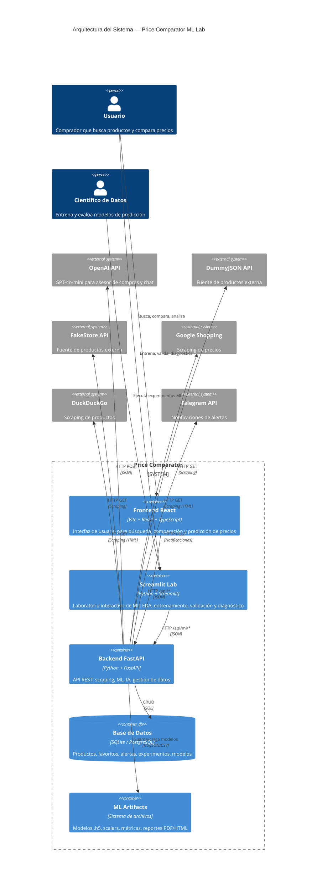
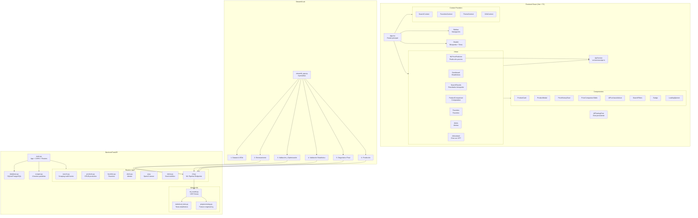
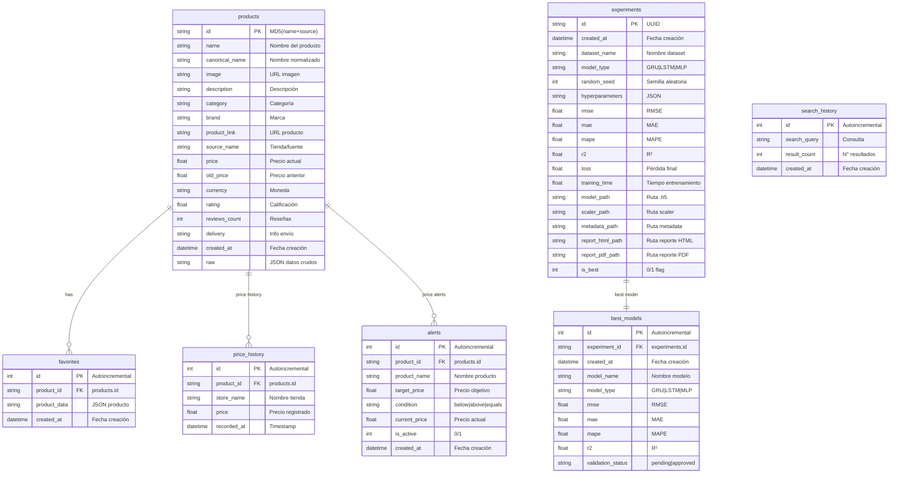
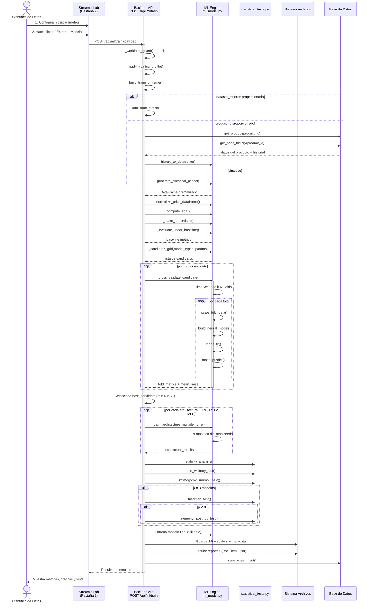
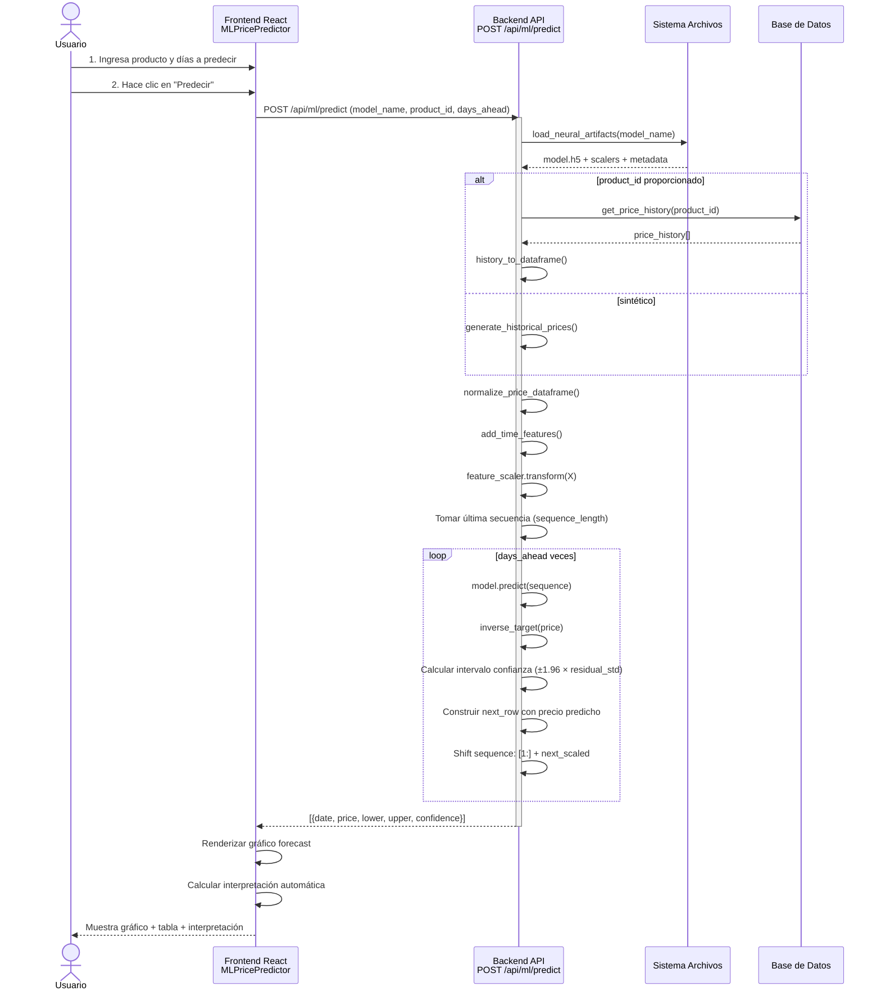
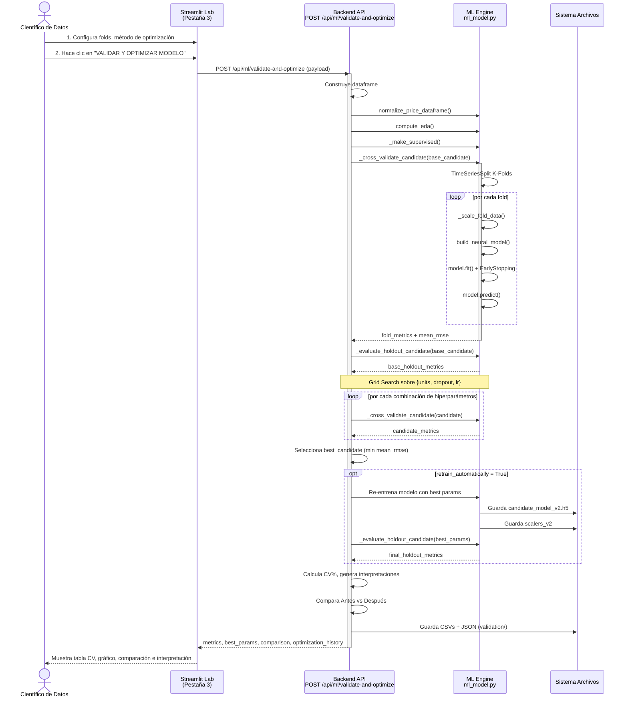

# Diagramas del Sistema — Price Comparator ML Lab

---

## 1. Diagrama de Arquitectura (C4 — Nivel Contenedor)



---

## 2. Diagrama de Componentes



---

## 3. Modelo de Datos (ER)



---

## 4. Diagrama de Secuencia — Entrenamiento de Modelo ML



---

## 5. Diagrama de Secuencia — Predicción de Precios



---

## 6. Diagrama de Secuencia — Validación y Optimización



---

## 7. Diagrama de Estados — Ciclo de Vida del Experimento

```mermaid
stateDiagram-v2
  [*] --> DatasetConfig: Usuario selecciona/carga datos

  state DatasetConfig {
    [*] --> Synthetic: Generación sintética
    [*] --> Uploaded: Archivo subido
    [*] --> Database: Historial BD
  }

  DatasetConfig --> EDAAnalysis: Datos listos
  EDAAnalysis --> EDAComplete: EDA ejecutado

  state EDAComplete {
    [*] --> CheckQuality: Validar calidad
    CheckQuality --> ReadyForTraining: Sin inconsistencias críticas
    CheckQuality --> DatasetConfig: Inconsistencias detectadas
  }

  ReadyForTraining --> Training: Usuario inicia entrenamiento

  state Training {
    [*] --> GridSearch: Búsqueda de hiperparámetros
    GridSearch --> CrossValidation: Evaluación candidatos
    CrossValidation --> SelectBestArchitecture: Selección mejor modelo
    SelectBestArchitecture --> StatisticalTests: Pruebas estadísticas
    StatisticalTests --> SaveModel: Guardar artefactos
    SaveModel --> TrainingComplete: Experimento finalizado
  }

  Training --> TrainingComplete: Modelo entrenado + artefactos guardados

  state TrainingComplete {
    [*] --> HasResults: Métricas + gráficos + tests disponibles
  }

  TrainingComplete --> ValidationOptimization: Usuario inicia validación

  state ValidationOptimization {
    [*] --> TimeSeriesSplit: Validación cruzada
    TimeSeriesSplit --> HyperparameterSearch: Optimización grid
    HyperparameterSearch --> Retrain: Reentrenamiento con best params
    Retrain --> CompareBaseline: Comparación Antes vs Después
    CompareBaseline --> OptimizationComplete
  }

  ValidationOptimization --> StatisticalValidation: Usuario inicia validación estadística

  state StatisticalValidation {
    [*] --> ExtractMetrics: Extraer scores por arquitectura
    ExtractMetrics --> RunTests: Ejecutar tests
    state RunTests {
      MannWhitney --> Friedman: Si >= 3 modelos
      Friedman --> Nemenyi: Si p < 0.05
      KolmogorovSmirnov
      StabilityAnalysis
    }
    RunTests --> GenerateConclusion: Conclusión automática
    GenerateConclusion --> Recommendation: Recomendación + confianza
    Recommendation --> StatsComplete
  }

  StatisticalValidation --> Diagnosis: Consolidación de resultados

  state Diagnosis {
    [*] --> CompileResults: Integrar resultados
    CompileResults --> GenerateReport: Generar reporte PDF
    GenerateReport --> ReadyForPublish
  }

  ReadyForPublish --> Published: Usuario pulsa "Publicar Modelo"

  state Published {
    [*] --> CopyArtifacts: Renombrar best_model.h5
    CopyArtifacts --> UpdateDB: save_best_model()
    UpdateDB --> Active: Modelo disponible para predicción
  }

  Active --> [*]: Nuevo experimento comienza
```



---

## 8. Diagrama de Flujo de Datos — Pipeline ML

```mermaid
flowchart LR
  subgraph Input["Entrada de Datos"]
    DS["Dataset histórico<br/>(CSV / BD / Sintético)"]
  end

  subgraph Prep["Preparación"]
    Norm["Normalización<br/>- Interpolación<br/>- Relleno diario"]
    FE["Feature Engineering<br/>- Time features<br/>- Lag features<br/>- Rolling features"]
    Super["Supervisión<br/>Ventanas deslizantes"]
  end

  subgraph Train["Entrenamiento"]
    BL["Baseline<br/>Linear Regression"]
    GS["Grid Search<br/>GRU / LSTM / MLP"]
    CV["Cross-Validation<br/>TimeSeriesSplit"]
    AS["Arquitectura<br/>Multiple runs x seed"]
    TS["Tests Estadísticos<br/>M-W, KS, Friedman..."]
  end

  subgraph Val["Validación"]
    CV2["TimeSeriesSplit<br/>K-Folds"]
    HP["Optimización<br/>Hiperparámetros"]
    RC["Reentrenamiento<br/>Best params"]
    COMP["Comparación<br/>Antes vs Después"]
  end

  subgraph StatVal["Validación Estadística"]
    MW["Mann-Whitney U"]
    KS["Kolmogorov-Smirnov"]
    FR["Friedman"]
    NM["Nemenyi Post-hoc"]
    ST["Stability Analysis"]
  end

  subgraph Output["Salida"]
    MODEL["Modelo .h5"]
    SCALER["Scalers"]
    METRICS["Métricas JSON"]
    REPORTS["Reportes MD/HTML/PDF"]
    BEST["best_model.h5"]
  end

  DS --> Norm --> FE --> Super

  Super --> BL
  Super --> GS
  GS --> CV
  CV --> AS
  AS --> TS
  TS --> MODEL
  MODEL --> SCALER
  MODEL --> METRICS

  MODEL --> CV2
  CV2 --> HP
  HP --> RC
  RC --> COMP

  COMP --> MW
  COMP --> KS
  COMP --> FR
  FR --> NM
  COMP --> ST

  MW --> BEST
  KS --> BEST
  NM --> BEST
  ST --> BEST
  BEST --> REPORTS

  style Input fill:#e1f5fe
  style Prep fill:#fff3e0
  style Train fill:#e8f5e9
  style Val fill:#fce4ec
  style StatVal fill:#f3e5f5
  style Output fill:#e0f7fa
```



---

## 9. Diagrama de Despliegue

```mermaid
graph TB
  subgraph Browser["Navegador Web"]
    ReactApp["Frontend React<br/>Vite + React + TS<br/>Puerto :5173"]
    StreamlitApp["Streamlit Lab<br/>Python Streamlit<br/>Puerto :8501"]
  end

  subgraph Render["Render Cloud"]
    subgraph FrontendService["price-comparator"]
      Nginx["Nginx / Node<br/>Sirve build Vite"]
      ReactBuild["Static Files<br/>dist/"]
    end

    subgraph APIService["price-comparator-api"]
      Uvicorn["Uvicorn<br/>FastAPI<br/>Puerto :8000"]
      ML_Artifacts["ML Artifacts<br/>/opt/render/project/src/backend/ml_models/"]
      Reports["Reports<br/>/opt/render/project/src/backend/reports/"]
    end

    subgraph MLService["price-comparator-ml-lab"]
      StreamlitServer["Streamlit Server<br/>Puerto dinámico"]
    end

    subgraph Database["PostgreSQL 15"]
      PG["price_comparator_db"]
    end
  end

  subgraph ExternalAPIs["APIs Externas"]
    OpenAI["OpenAI API<br/>GPT-4o-mini"]
    DummyJSON["DummyJSON API"]
    FakeStore["FakeStore API"]
    Google["Google Shopping<br/>Scraping"]
    DuckDuckGo["DuckDuckGo<br/>Scraping"]
    Telegram["Telegram API"]
  end

  User1["Usuario Final"] --> ReactApp
  User2["Científico Datos"] --> StreamlitApp
  ReactApp -->|HTTP| Uvicorn
  StreamlitApp -->|HTTP| Uvicorn
  Uvicorn --> PG
  Uvicorn --> ML_Artifacts
  Uvicorn --> Reports
  Uvicorn --> OpenAI
  Uvicorn --> DummyJSON
  Uvicorn --> FakeStore
  Uvicorn --> Google
  Uvicorn --> DuckDuckGo
  Uvicorn --> Telegram

  ReactApp -.->|Desarrollo| Vite["Vite Dev Server<br/>localhost:5173"]
  StreamlitApp -.->|Desarrollo| LocalStreamlit["streamlit run<br/>localhost:8501"]
  Uvicorn -.->|Desarrollo| LocalUvicorn["uvicorn --reload<br/>localhost:8000"]
  LocalUvicorn -.-> SQLite["SQLite<br/>price_comparator.db"]
